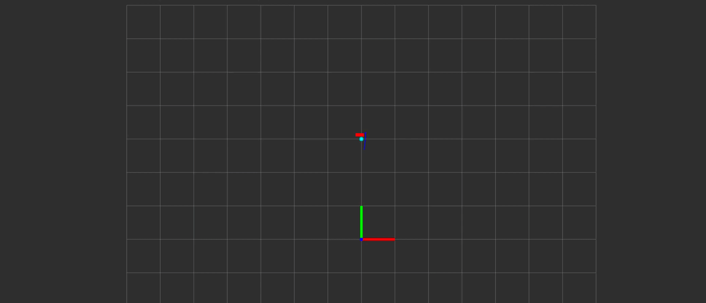
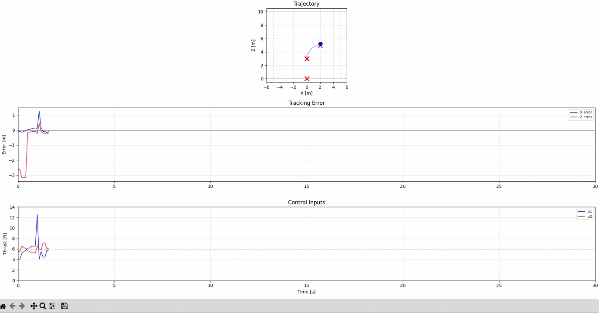

# О проекте

В проекте реализовано 2D движение квадрокоптера по набору заданных точек. Для управления используется нелинейный MPC. В симуляторе присутствует синусоидальное ветровое возмущение.

В проекте настроена визуализация через Rviz2



Динамическая отрисовка графиков через Matplotlib по мере движения дрона



# Технологии
- **ROS 2 Humble** – фреймворк для разработки робототехнических приложений  
- **Python 3.10** – основной язык
- **RViz 2** – визуализация 
- **Colcon** – сборка ROS 2 пакетов  
- **WSL 2** – среда разработки на Windows  

# Руководство по установке 

Сперва необходимо клонировать проект
```bash
git clone https://github.com/PivIrina/quad_project_control.git
```
Перейте в репозиторий установки и собирать проект
```bash
colcon build
```
Настроить окружение
```bash
source /opt/ros/humble/setup.bash   # окружение ROS
source ./install/setup.bash
```
Для запуска проекта единовременно всех нод необходимо выполнить команду
```bash
ros2 launch quad_control sim.launch.py
```
В launch-файле также можно изменить стартовые параметры симмуляции.

Для визуализации через Rviz2 неоходимо выполнить команду во 2-м терминале
```bash
rviz2
```


# Изменение стартовых параметров через launch

Модель ветра описывается синусоидальным законом wind_amplitude * sin (wind_frequency * t)
```bash
parameters=[{
      "wind_amplitude": 1.0,    # амплитуда 
      "wind_frequency": 0.5,    # частота 
      }]
```
Изменение точек облёта и времени задержки
```bash
parameters=[{
      "waypoints": "0,3,2,5,-2,4,0,6,3,3,-3,2,0,3",
      "hold_time": 5.0,         
            }]
```
Точки следует записывать последовательно. В данном примере задано 7 точек облёта: (0,3),(2,5),(-2,4),(0,6),(3,3),(-3,2),(0,3)


